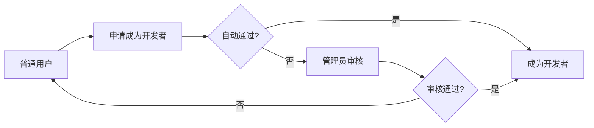
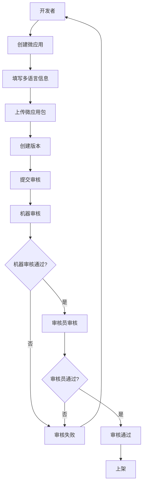
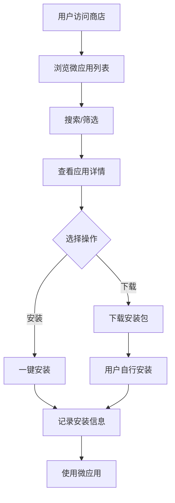

# 微应用商店项目概述

## 项目定位

本项目是 **Sun-Panel 平台**的核心微服务平台之一，定位为**微应用（插件）商店平台**。专注于微应用的管理、分发、审核全流程，为平台提供可扩展的插件生态系统。

### 什么是微应用？
微应用是基于 **Lit + WebComponents** 技术栈开发的轻量级组件，具有独立性强、复用性高、易于集成的特点，可无缝集成到 Sun-Panel 平台的各个场景中。

---

## 核心功能

### 1. 微应用管理
- **创建微应用**：开发者可创建自己的微应用，支持多语言配置（名称、描述等）
- **版本管理**：支持多版本发布、版本历史追溯
- **分类管理**：微应用按分类组织，便于用户查找

### 2. 微应用分发
- **下载**：用户可下载微应用安装包
- **安装**：支持一键安装到用户面板
- **更新**：支持版本更新提醒和安装

### 3. 审核体系
- **机器审核**：自动化安全检测（调用第三方 API，暂未开发）
- **人工审核**：审核员进行内容和质量审核
- **审核流程**：机器审核 → 审核员审核 → 上架

### 4. 多语言支持
- 微应用信息支持多语言（中文、英文、日文等）
- 用户端自动根据语言偏好显示对应内容

---

## 角色体系

### 角色定义（使用位运算）

```
ROLE_USER      = 1   // 普通用户 (00001)
ROLE_DEVELOPER = 2   // 开发者   (00010)
ROLE_ADMIN     = 4   // 管理员   (00100)
ROLE_AUDITOR   = 8   // 审核员   (01000)
ROLE_OPERATOR  = 16  // 运营     (10000)
```

### 角色权限说明

| 角色 | 权限说明 |
|------|---------|
| **普通用户** | • 浏览微应用列表<br>• 下载、安装微应用<br>• 查看微应用详情<br>• 查看自己已安装的应用 |
| **开发者** | 普通用户权限 +<br>• 申请成为开发者<br>• 创建微应用<br>• 发布微应用版本<br>• 管理自己的微应用 |
| **审核员** | • 审核微应用版本<br>• 审核通过/拒绝<br>• 添加审核备注<br>• 查看审核历史 |
| **管理员** | 所有权限 +<br>• 管理分类<br>• 管理开发者<br>• 管理用户<br>• 查看统计数据<br>• 系统配置 |
| **运营** | 后期扩展角色<br>• 数据统计<br>• 推广管理 |

### 角色叠加
支持一个用户拥有多个角色，例如：
- 开发者 + 管理员 = 6 (二进制: 00110)
- 审核员 + 管理员 = 12 (二进制: 01100)

---

## 核心业务流程

### 1. 开发者申请流程



**流程说明**：
1. 普通用户提交开发者申请（填写开发者名称、联系方式）
2. 系统判断是否自动通过（根据配置）
3. 自动通过则立即获得开发者权限
4. 需要审核则进入管理员审核流程

---

### 2. 微应用发布流程



**流程说明**：
1. 开发者创建微应用，填写基本信息和多语言内容
2. 上传微应用安装包，创建版本
3. 提交版本进入审核流程
4. 机器审核（安全扫描、病毒检测、代码审查）
5. 审核员人工审核（内容质量、合规性）
6. 审核通过后自动上架

**审核状态**：
- `0` - 待审核
- `1` - 审核通过
- `2` - 审核拒绝

---

### 3. 用户使用流程



**流程说明**：
1. 用户访问微应用商店
2. 通过分类、搜索等方式浏览微应用
3. 查看微应用详情（支持多语言）
4. 选择下载或直接安装
5. 系统记录下载/安装信息
6. 用户在面板中使用微应用

---

## 数据统计

### 记录的数据
- **下载量**：每个微应用、每个版本的下载次数
- **安装量**：安装次数、活跃用户数
- **用户行为**：安装设备、IP、时间等
- **开发者统计**：应用数量、下载总量、收入统计

### 统计维度
- 按时间统计（日、周、月）
- 按分类统计
- 按开发者统计
- 按地区统计

---

## 积分体系（暂未开发）

### 积分来源
- 用户安装微应用
- 用户购买付费应用
- 用户充值

### 积分规则
- 每次安装获得积分（可配置）
- 开发者获得用户安装积分分成
- 积分可提现

---

## 付费模式（暂未开发）

### 收费类型
- **免费**：完全免费使用
- **付费**：一次性购买
- **订阅**：按月/年订阅

### 购买流程
1. 用户选择付费应用
2. 支付购买
3. 记录购买信息
4. 开通使用权限

---

## 扩展功能（后期规划）

### 1. 评价系统
- 用户评价微应用
- 评分（1-5星）
- 评论内容
- 评价统计

### 2. 举报系统
- 举报违规微应用
- 举报原因分类
- 管理员处理举报

### 3. 推荐系统
- 热门推荐
- 个性化推荐
- 分类精选

### 4. 开发者中心增强
- 数据看板
- 收入统计
- 用户反馈
- 版本分析

---

## 技术特点

### 1. 多语言支持
- 微应用信息多语言存储
- 自动语言降级（无对应语言时使用默认语言）
- 高效查询（JOIN 查询一次获取）

### 2. 审核机制
- 机器审核 + 人工审核双重保障
- 审核流程可配置
- 审核记录可追溯

### 3. 权限管理
- 基于位运算的角色管理
- 支持角色叠加
- 易于扩展新角色

### 4. 数据追踪
- 完整的下载、安装记录
- 支持匿名用户追踪（client_id）
- 用户行为分析

---

## 数据库表概览

| 表名 | 说明 | 核心字段 |
|------|------|---------|
| `micro_app` | 微应用列表 | micro_app_id, app_name, category_id, author_id, status |
| `micro_app_lang` | 微应用多语言 | micro_app_id, lang, app_name, app_desc |
| `micro_app_version` | 微应用版本 | app_id, version, version_code, status |
| `micro_app_category` | 应用分类 | name, icon, sort, status |
| `developer` | 开发者 | user_id, developer_name, contact_mail, status |
| `micro_app_download` | 下载记录 | app_id, version_id, user_id, client_id, download_ip |
| `micro_app_install` | 安装记录 | app_id, version_id, user_id, client_id, install_time |
| `user` | 用户表 | role（位运算存储角色） |

---

## API 接口分类

### 用户端接口
- 微应用列表查询（支持多语言）
- 微应用详情查询
- 微应用下载
- 微应用安装记录

### 开发者接口
- 开发者注册
- 创建微应用
- 发布版本
- 管理微应用

### 管理端接口
- 分类管理
- 开发者管理
- 用户管理
- 数据统计

### 审核员接口
- 待审核列表
- 审核操作
- 审核历史

---

## 项目价值

1. **生态建设**：为 Sun-Panel 平台构建丰富的微应用生态
2. **降低门槛**：开发者可快速发布微应用，用户可便捷获取
3. **质量保障**：双重审核机制确保微应用质量和安全性
4. **商业价值**：支持付费模式，激励开发者创作优质应用
5. **用户体验**：多语言支持、智能推荐，提升用户满意度
