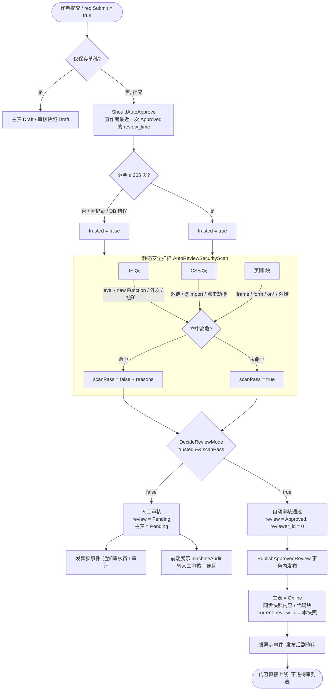

# 自定义代码「作者信任 + 自动审核 + 安全扫描门禁」需求文档

> 状态：已实现（流程图见第 7 节）
> 关联：自定义代码（JS / CSS / 页脚 HTML）提交审核流程

## 1. 目标

- 自定义代码**首次（作者未被信任）提交**进入人工审核队列。
- 作者**曾经有帖子审核通过过、且最近一年内有过审核通过记录**时，再次提交**自动审核通过**，直接覆盖线上内容。
- 自动通过前叠加**自动化安全扫描门禁**，命中高危模式则降级为人工审核。

## 2. 判定逻辑（确认后口径）

> 提交审核（`req.Submit`）时，按**作者维度**判定：
> 1. 查该作者名下是否存在 `custom_code_review.status = 已通过(Approved)` 的记录；
> 2. 取其中**最新的那条 Approved 的 `review_time`**，若距今 ≤ 365 天 → 视为「作者受信任」；
> 3. 满足「作者受信任」→ 本次提交走**自动通过**（但仍过安全扫描门禁）；否则走**人工审核**。

说明：
- 判定以**作者**为单位（不是单个帖子）。只要作者近一年内有任意帖子被人工通过过，其所有帖子都可享受自动通过。
- 「超过一年没有审核过的帖子」→ 即作者最近一次 Approved 距今 > 365 天 → 落入人工审核（每年至少被人复核一次）。
- 若作者历史上从未有任何帖子通过 → 人工审核。

## 3. 自动化安全扫描门禁（核心）

自动通过 = 零人工复核，而自定义代码会注入到**用户自己的面板**执行，必须先过一道静态扫描。

- **时机**：**每次提交都会执行**（无论作者是否受信任），并非只在自动通过路径。扫描结果既作为自动审核的闸门，也会随 `machineAudit` 落库，供审核员快速定位风险点。在 `PublishApprovedReview` 之前执行。
- **方式**：静态扫描（不执行代码），按块类型匹配危险模式，见第 4 节。
- **结果**：
  - 全部通过 → 自动通过上线。
  - **命中任一高危模式 → 降级为人工审核**（不是自动拒绝，避免误杀正常代码）。
- **误报权衡**：自定义代码本就是让用户跑自己的代码，`fetch` 调自家接口、`localStorage` 存设置、引用 CDN 库均属正常。扫描只聚焦「数据发往外部第三方 / 加载远程可执行代码」，且命中即转人工，由人终审。

## 4. 扫描内容清单（按类型）

### JS
- 数据外发第三方：`fetch` / `XMLHttpRequest` / `navigator.sendBeacon` / `new WebSocket` 指向 `http(s)://` 外部域名（不要求拼接 cookie/storage）。
- 远程/动态执行：`new Function(...)`、`eval(...)`、`setTimeout/setInterval(字符串)`、以及 DOM 注入 `innerHTML=` / `outerHTML=` / `document.write` / `<script`（含 `<script src>`）。
- 钓鱼/劫持：`location.href/replace/assign = http(s)://` 或 `window.open(...)` 外跳。
- 已知恶意：挖矿域名特征（`coinhive` / `minero` / `jsecoin` / `cryptonight`）、`atob(...)+eval/Function` 混淆加载器。

### CSS
- `url(http(s)://...)` 外链资源（追踪/泄露 IP）、`@import` 外部样式。
- 点击劫持：透明 `position:fixed/absolute` + 高 `z-index` + `opacity:0` 覆盖层。

### 页脚 HTML
- `<script>` **已放开**（产品需求允许页脚包含脚本），不再拦截。
- 仍禁止 `<iframe>` / `<object>` / `<embed>` / `<form>`、`on*` 内联事件（`onload`/`onclick` 等）、外链跳转 `href/src`。

## 5. 建议落地的实现（待确认后开发）

独立文件 `admin/customCodeReviewFlow.go`，便于以后改策略：

```go
// 作者最近一次审核通过的时间；无则返回零值
func AuthorLatestApprovedTime(db *gorm.DB, authorId uint) (time.Time, error)

// 策略决策：作者近一年内有通过记录才允许自动
func ShouldAutoApprove(authorId uint) (bool, error)

// 自动化安全扫描门禁；命中高危返回 pass=false + 原因
func AutoReviewSecurityScan(blocks []models.CustomCodeBlock) (pass bool, reasons []string)

// 发布上线（人工 Approve 与自动通过共用同一逻辑）
func PublishApprovedReview(db *gorm.DB, mainID, reviewID uint, reviewerId uint, note string) error
```

调用点：`admin/customCode.go` 的 `Edit`，当 `req.Submit` 时：
1. `auto, _ := ShouldAutoApprove(authorId)`；
2. 若 `auto`：`ok, reasons := AutoReviewSecurityScan(blocks)`；`ok` 为假 → 视为人工；
3. 标记状态 `Pending`（人工）或 `Approved`（自动）；
4. 自动：`PublishApprovedReview(...)`（reviewer_id=0，note="自动审核通过"）。

数据查询：`AuthorLatestApprovedTime` 用 `custom_code_review` JOIN `custom_code`（取 `author_id`）
`WHERE c.author_id = ? AND r.status = Approved ORDER BY r.review_time DESC LIMIT 1`。

## 6. 已确认 / 待确认

已确认：
- 判定维度：**作者**（非单帖）。
- 有效期：**365 天**，超期落人工。
- 必须有**安全扫描门禁**，命中转人工。

待你最终确认（如无异议即按上述开发）：
- 扫描命中后的处理是「转人工」而非「直接拒绝」——是否认可？
- 是否维护「可信域名白名单」（如放行 jsdelivr/unpkg）以降低误报？默认不做，先靠人工终审。
- 1 年有效期是否按「作者最近一次通过」计算（而非「单帖最近一次通过」）？

## 7. 自动审核流程图



### 7.1 图中要点速查

- **信任窗口**：`AuthorTrustWindow = 365 天`（`customCodeReviewFlow.go:14`），按作者最近一次 Approved 的 `review_time` 计算，滚动有效。
- **两道闸门**：`trusted`（作者受信任）与 `scanPass`（安全扫描通过），**必须同时为真**才走自动（`DecideReviewMode`，`customCodeReviewFlow.go:28`）。
- **受信任也要扫**：信任只免人工，不免除安全扫描门禁。
- **命中即转人工，不拒绝**：避免误杀正常代码（如 `fetch` 调自家接口、`localStorage` 存配置）。
- **machineAudit**：每次提交都落库 `{auto, trusted, scanPass, reasons, time}`，供审核员在列表/详情看到"为何转人工"。
- **自动通过直接上线**：经 `PublishApprovedReview` 事务发布，不进入待审队列。

