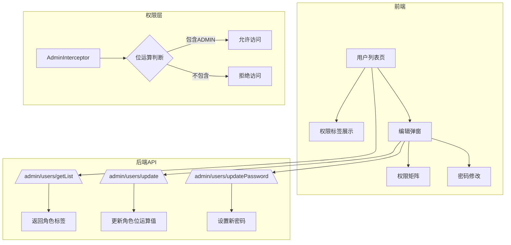

## 产品概述

完善微应用商店的用户管理权限系统，实现基于位运算的多角色权限体系，支持管理员修改用户密码，并提供直观的权限展示界面。

## 核心功能

### 1. 用户权限完善

- 实现位运算角色体系，支持5种角色：普通用户(1)、开发者(2)、管理员(4)、审核员(8)、运营(16)
- 支持角色叠加，一个用户可拥有多个角色（如：开发者+管理员=6）
- 提供角色判断工具函数（HasRole、AddRole、RemoveRole）

### 2. 权限展示界面

- 用户列表页面增加权限标签列，直观显示用户所有角色标签
- 用户编辑弹窗中显示权限矩阵，以复选框形式展示所有可选角色
- 支持多角色选择和取消

### 3. 管理员修改密码

- 管理员可直接设置用户新密码（无需原密码验证）
- 修改密码后自动清除用户Token，强制重新登录
- 密码使用MD5三次加密存储

## 技术栈选择

### 后端

- **框架**: Go + Gin（沿用现有架构）
- **ORM**: GORM
- **权限模式**: 位运算角色体系

### 前端

- **框架**: Vue 3 + TypeScript
- **UI组件库**: Naive UI（沿用现有）
- **状态管理**: Pinia

## 实现方案

### 位运算角色体系设计

按照文档设计，定义角色常量：

```
ROLE_USER      = 1   // 普通用户   (二进制: 00001)
ROLE_DEVELOPER = 2   // 开发者     (二进制: 00010)
ROLE_ADMIN     = 4   // 管理员     (二进制: 00100)
ROLE_AUDITOR   = 8   // 审核员     (二进制: 01000)
ROLE_OPERATOR  = 16  // 运营       (二进制: 10000)
```

**位运算操作**：

- 判断角色：`(userRole & role) !== 0`
- 添加角色：`userRole |= role`
- 移除角色：`userRole &= ^role`

**数据迁移策略**：
现有数据 Role=1(管理员) 映射为 ROLE_ADMIN(4)，Role=2(普通用户) 映射为 ROLE_USER(1)

### 后端修改要点

1. **新增角色常量定义文件** `service/models/role.go`
2. **修改 AdminInterceptor** 支持位运算判断
3. **新增管理员修改密码API** `/admin/users/updatePassword`
4. **修改用户列表API** 返回角色标签列表

### 前端修改要点

1. **类型定义扩展** 增加角色常量和角色信息接口
2. **用户列表页改造** 角色列显示为标签组
3. **用户编辑弹窗改造** 角色选择改为多选复选框矩阵
4. **新增密码修改功能** 在编辑弹窗中增加密码输入

## 架构设计



## 目录结构

### 后端文件变更

```
service/
├── models/
│   └── role.go                    # [NEW] 角色常量定义和位运算工具函数
├── api/api_v1/
│   ├── middleware/
│   │   └── AdminInterceptor.go    # [MODIFY] 改用位运算判断管理员权限
│   └── admin/
│       └── users.go               # [MODIFY] 新增UpdatePassword方法，修改返回角色标签
└── router/admin/
    └── users.go                   # [MODIFY] 注册updatePassword路由
```

### 前端文件变更

```
src/
├── typings/
│   ├── user.d.ts                  # [MODIFY] 增加roles字段和角色类型定义
│   └── admin/
│       └── adminUserManage.d.ts   # [MODIFY] 增加密码修改请求类型
├── api/
│   └── admin/
│       └── index.ts               # [MODIFY] 新增AdminUserManageUpdatePassword方法
├── views/admin/userManage/
│   ├── index.vue                  # [MODIFY] 角色列改为标签组展示
│   └── EditUser/
│       └── index.vue              # [MODIFY] 角色选择改为权限矩阵，新增密码修改
└── utils/
    └── role.ts                    # [NEW] 角色位运算工具函数
```

## 实现细节

### 数据迁移

需要在后端初始化时检测并迁移旧数据：

- Role=1 → Role=4 (ROLE_ADMIN)
- Role=2 → Role=1 (ROLE_USER)

### 密码安全

- 使用现有的 `cmn.PasswordEncryption()` 函数（MD5三次加密）
- 修改密码后清除用户Token，强制重新登录

### 权限判断性能

- 位运算判断为O(1)复杂度，无性能问题
- 角色标签列表在前端计算生成，不影响后端性能

## 设计风格

采用简洁专业的管理后台设计风格，与现有系统保持一致。使用Naive UI组件库，保持视觉统一性。

## 页面设计

### 用户列表页改造

- **角色列展示**：使用NTag标签组显示用户所有角色，不同角色使用不同颜色区分
- 管理员：红色标签
- 开发者：蓝色标签
- 审核员：绿色标签
- 运营：橙色标签
- 普通用户：灰色标签

### 用户编辑弹窗改造

- **权限矩阵区域**：使用NCheckboxGroup实现多选权限矩阵
- 每个角色一个复选框，支持多选
- 显示角色名称和简短描述
- 布局：横向排列，自动换行
- **密码修改区域**：
- 新增密码输入框（可选填写）
- 提示文字："留空则不修改密码"
- 密码强度提示

## SubAgent

- **code-explorer**: 在实施过程中探索相关代码文件，确保修改的完整性和准确性